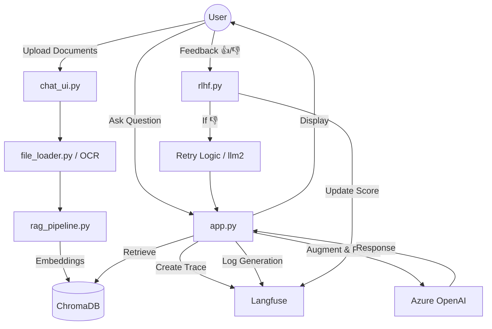
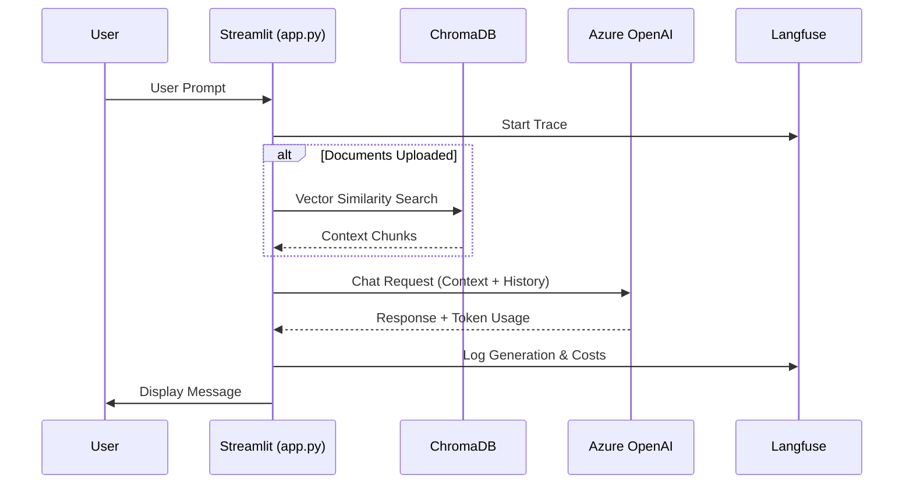
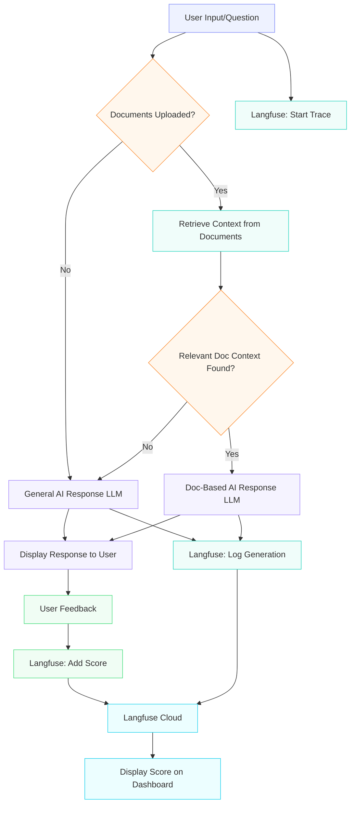

# 🤖 Chatgpt-Rag-Pdf-App Documentation

## 📌 Project Overview
This application is a sophisticated **Retrieval-Augmented Generation (RAG)** chatbot built with Python and Streamlit. It integrates **Azure OpenAI** for intelligence, **ChromaDB** for vector storage, and **Langfuse** for observability and Reinforcement Learning from Human Feedback (RLHF).

---

## 🗺️ Visual Workflow

### System Flowchart

### Chat Logic Sequence

### Langfuse Cloud Connection Workflow

---

## �📂 Folder & File Workflow

### 1. Core Orchestration
*   **`app.py`**: The main entry point. It manages the Streamlit UI layout, handles the chat loop, coordinates between the RAG pipeline and general LLM fallbacks, and manages Langfuse trace life cycles.
*   **`config.py`**: Centralized configuration management. Loads environment variables for Azure OpenAI and Langfuse.

### 2. Authentication & Session
*   **`utils/session.py`**: Initializes the Streamlit `session_state` (messages, user info, retriever).
*   **`auth/` (referenced in app.py)**: Handles user `login` and `register` logic.
*   **`db.py`**: The data layer. Uses SQLite to store users, chat sessions, message history, and user feedback. It also initializes the persistent ChromaDB client.

### 3. RAG Pipeline (The "Brain")
*   **`rag/file_loader.py`**: A multi-format document parser. It handles `.pdf`, `.txt`, `.docx`, and even images (using OCR via Tesseract).
*   **`rag/rag_pipeline.py`**: The ingestion engine. It takes loaded documents, splits them into chunks using `RecursiveCharacterTextSplitter`, generates embeddings via Azure OpenAI, and stores them in **ChromaDB**.
*   **`chat/chat_engine.py`**: Configures the LLM instances (Primary for standard queries, Secondary for retries/refinement).

### 4. UI & Interaction
*   **`chat/chat_ui.py`**: Renders the sidebar, manages chat history selection, and handles the file upload interface.
*   **`chat/history.py`**: Utility to fetch formatted chat history for LLM context.

### 5. Observability & RLHF
*   **`utils/langfuse_utils.py`**: Integration layer for Langfuse. It logs "Traces" (the whole interaction), "Generations" (the LLM call), and "Scores" (usage metrics like cost and tokens).
*   **`feedback/rlhf.py`**: Manages the "Thumbs Up/Down" UI. It saves feedback to the local database and sends a numerical score (1.0 or 0.0) to Langfuse to help evaluate model performance.

---

## 🔄 System Workflow

### A. Document Ingestion
1.  User uploads a file via the Sidebar (`chat_ui.py`).
2.  `file_loader.py` saves the file temporarily and extracts text.
3.  `rag_pipeline.py` creates vector embeddings and saves them to `ChromaDB_LangFuse/`.
4.  A `retriever` object is stored in the session state.

### B. Chat Interaction
1.  User sends a prompt in `app.py`.
2.  **Tracing Starts**: A Langfuse span is opened.
3.  **Context Retrieval**: If a retriever exists, the system searches ChromaDB for relevant document segments.
4.  **Logic Branching**:
    *   If relevant docs are found: The LLM answers strictly based on the documents.
    *   If no docs are found: The system falls back to a general AI response using chat history.
5.  **Logging**: `log_generation` records the prompt, completion, and token usage (cost calculation).

### C. Feedback Loop (RLHF)
1.  The user clicks 👍 or 👎.
2.  `handle_feedback` triggers.
3.  If 👎 (Bad), the system deletes the last message from the UI, sets a `retry_trigger`, and `app.py` generates a *new* response using a different instruction set/model.
4.  The feedback is synced to Langfuse as a "Score" against the specific `trace_id`.

---

## 🛠️ Tech Stack Summary
| Component | Technology |
| :--- | :--- |
| **Frontend** | Streamlit |
| **Database (Relational)** | SQLite |
| **Database (Vector)** | ChromaDB |
| **LLM / Embeddings** | Azure OpenAI (GPT-4 / Text-Embedding-Ada) |
| **Tracing / Eval** | Langfuse |
| **Document Parsing** | PyPDF2, python-docx, Pytesseract (OCR) |

---

## 🚀 Execution Flow
1.  `streamlit run app.py`
2.  User logs in.
3.  User uploads a PDF.
4.  User asks a question.
5.  System retrieves PDF context -> Generates Answer -> Logs to Langfuse.
6.  User provides feedback -> Score updated in Langfuse dashboard.

## 📈 Monitoring
All interactions can be monitored in real-time at cloud.langfuse.com, where you can see:
*   Latency of LLM calls.
*   Token consumption and estimated cost.
*   Success/Failure rates of document retrieval.
*   User satisfaction trends based on RLHF scores.

---
*Documentation generated for the Chatgpt-Rag-Pdf-App project.*
